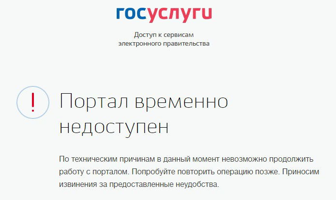
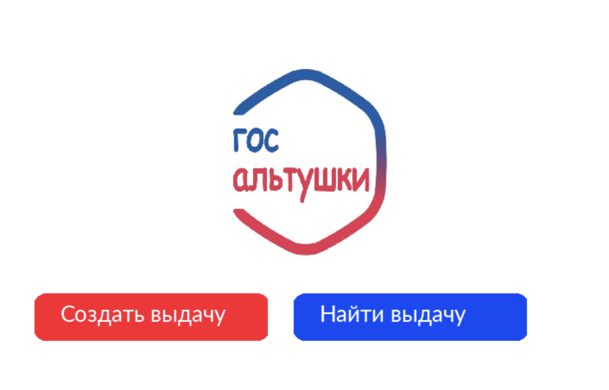

<h1>Приложение ГосАльтушки</h1> 

Представляем вашему вниманию уникальный и актуальный сервис. Проблемы с регистрацией на госуслугах? Тяжело разобраться в интерфейсе? Вы получили статус скуфа, но не можете добиться выплат? 
    
<h3>Мы ваше решение!</h3> 

С помощью сервиса ГосАльтушки вы сможете без проблем получить свою преварительную альтушку. Регистрация очень проста, единственное требование - взять с собой друга, но так ведь еще интереснее 
 
<h2>Язык: Python</h2> 
<h2>Библиотеки: Socket, Pygame</h2> 
<h2>Интерфейс:</h2>

